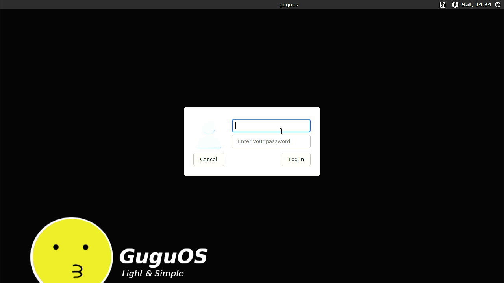
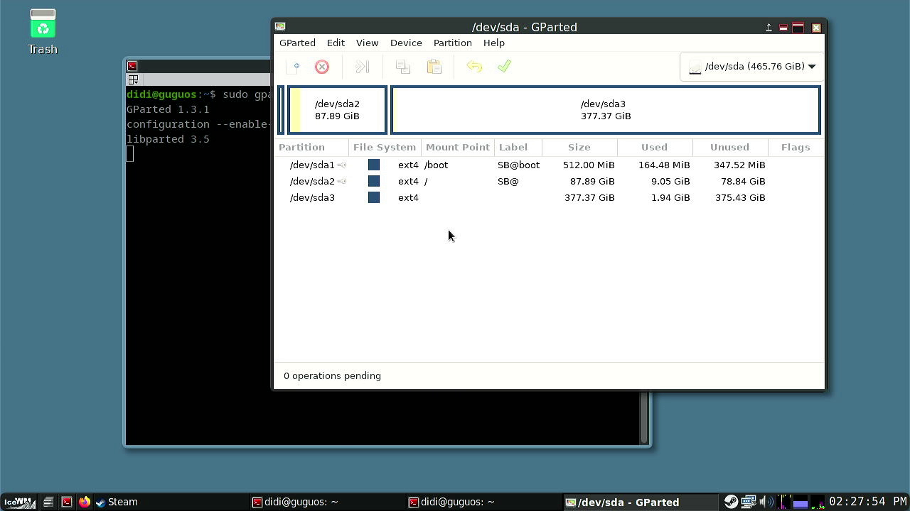
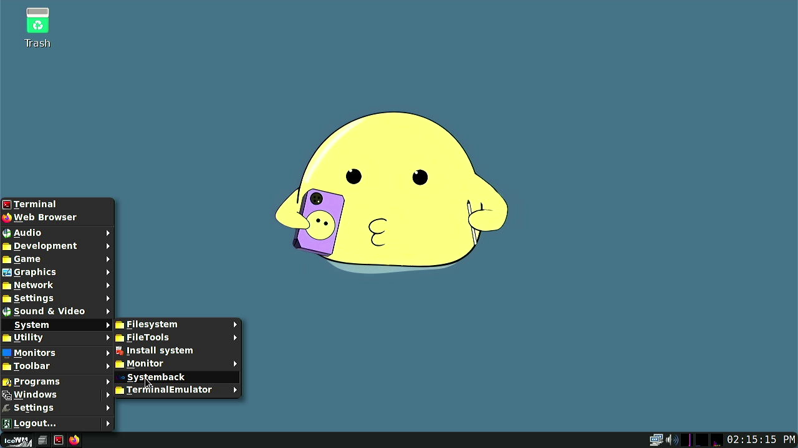
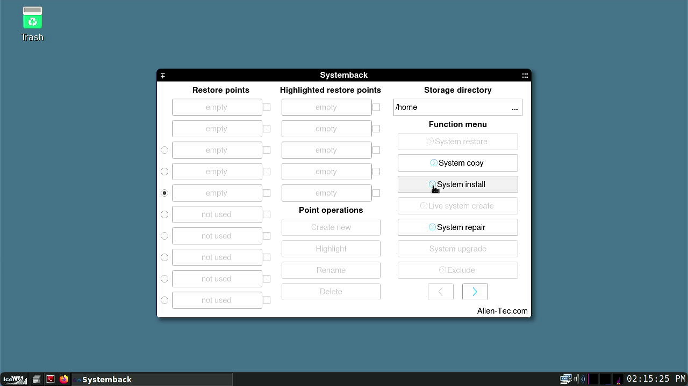
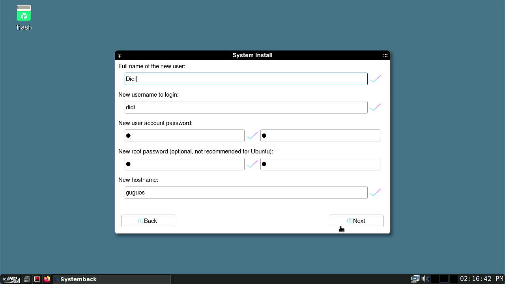
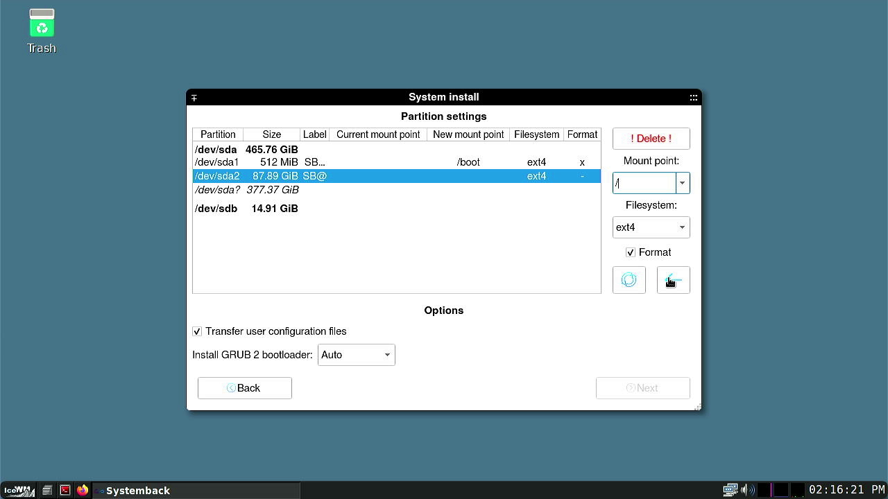
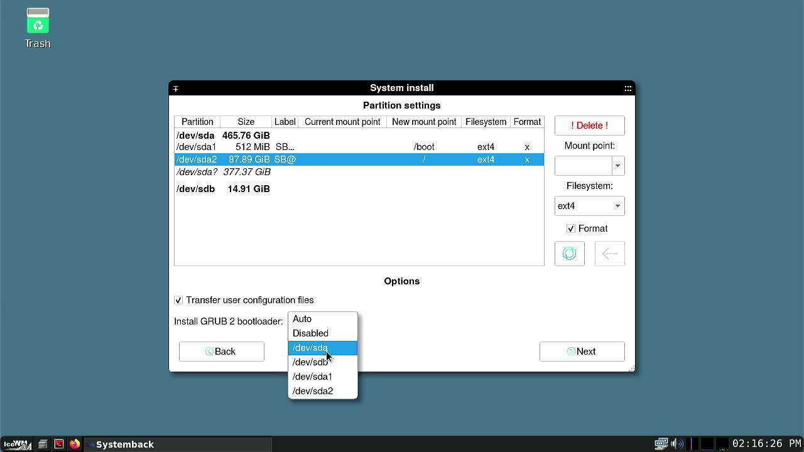
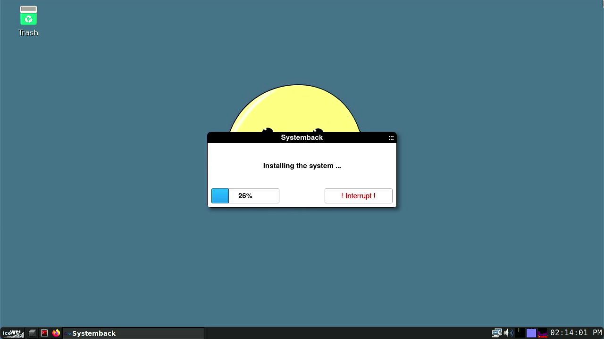

# 🐧 GuguOS

GuguOS is a Linux backup system based on Debian 12, designed to turn your PC into a gaming machine using Steam. GuguOS is lightweight and capable of launching Steam Big Picture mode right at login. However, it requires some initial configuration before full use.

---

## ⚠️ **Note**

**GuguOS cannot be used on dualboot systems.**  
**GuguOS is not beginner-friendly, so all risks are your responsibility.**

---

## 🔧 Installation Guide

1. Download the latest version of GuguOS  

2. Use any bootable media creation tool (Rufus, dd, etc.)  

3. Boot into the GuguOS bootable media  
4. Enter login credentials:  
   - Username: `gugu`  
   - Password: `1`  



5. Open terminal (CTRL + T), then run GParted:  

```bash
sudo gparted
```

6. Partition your disk (minimum `/boot` & `/`), then apply changes:  
   - `/boot` = 512MB (fat32/ext4)  
   - `/` = Min. 20000 GiB (ext4)  



7. Navigate to: `Taskbar Menu > System > Systemback`  



8. In Systemback, choose **System Install**  



9. Fill out the installation form as needed, then click **Next**  



10. In the **Partition** step, select **Mount Point** based on your earlier partitioning, then click the arrow button `[ <- ]`  



11. Set the bootloader to the disk where GuguOS will be installed (`/dev/sdX`)  



12. Wait until the installation is complete  



---
