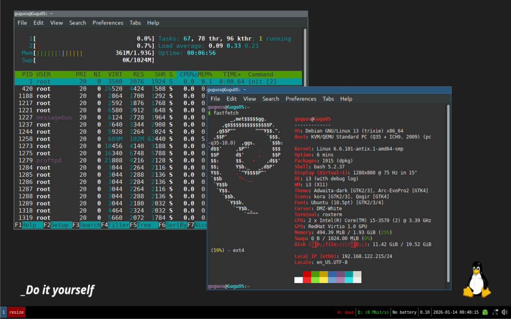
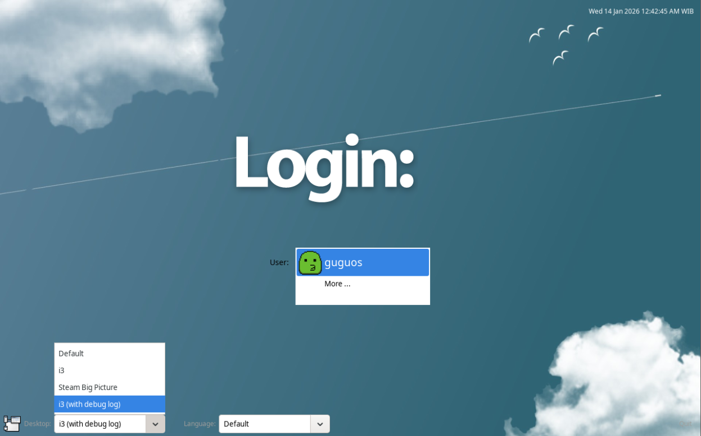
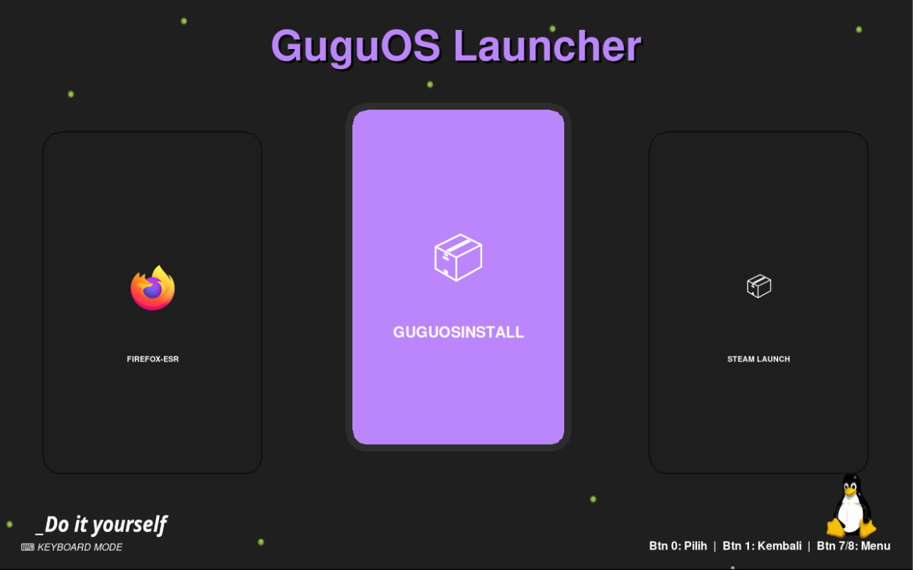
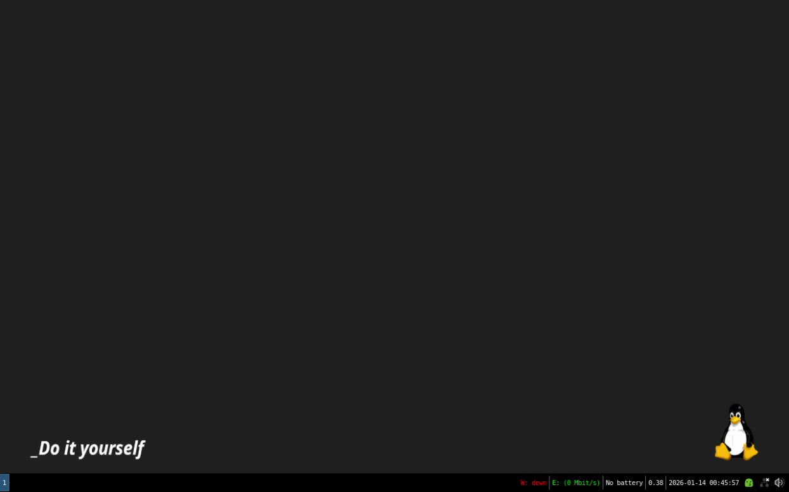
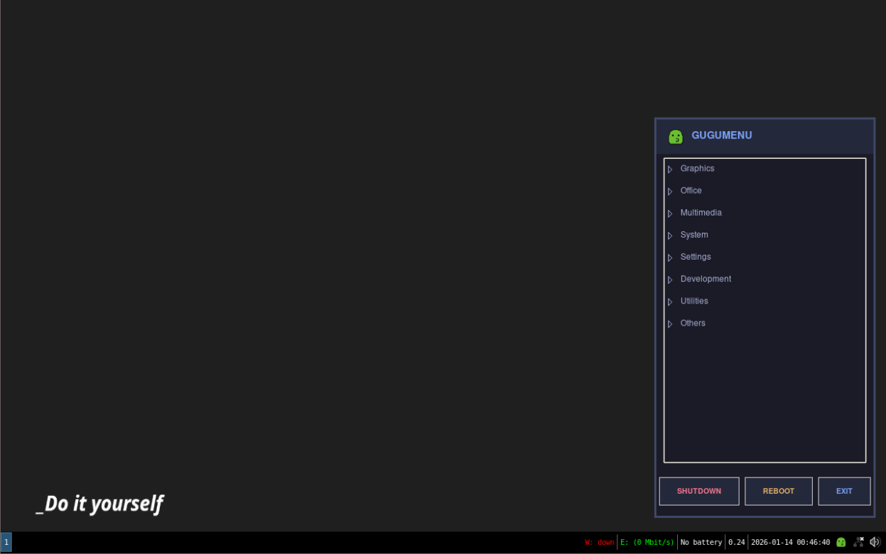
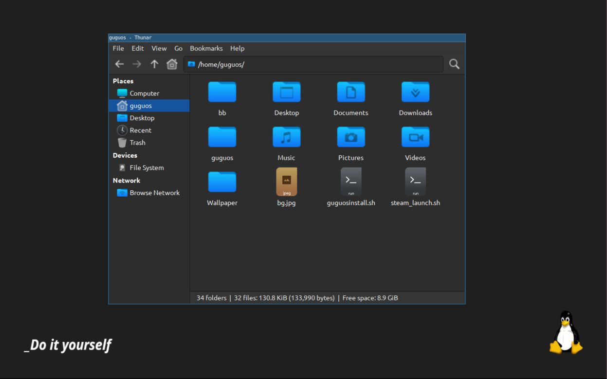
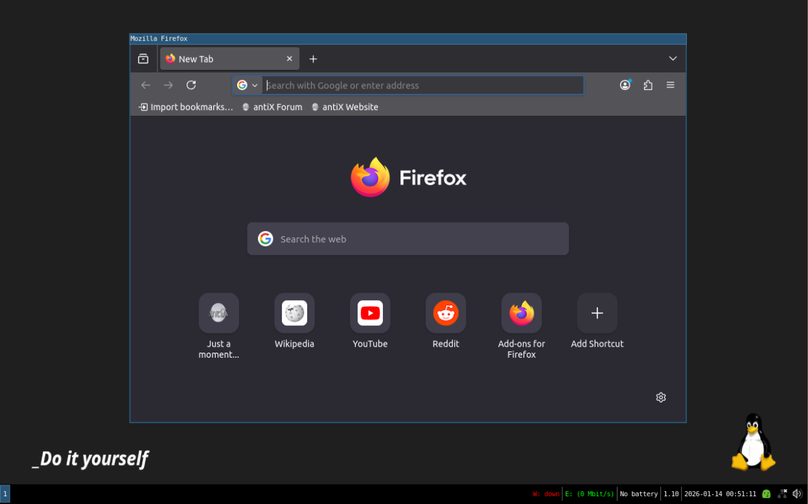
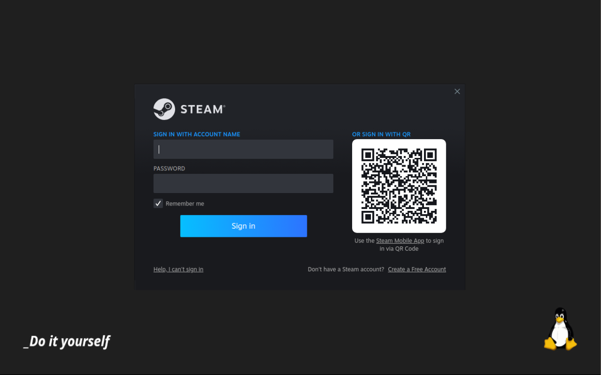

# 🐧 GuguOS

  
   
  <b>Main Interface of GuguOS</b> 
  <i>A Debian-based operating system designed to be lightweight with Steam Big Picture integration for an optimized gaming experience.</i>

---

## ⚠️ **Note**

> [!CAUTION]
> * **GuguOS is NOT recommended** for dual-boot systems.
> * **GuguOS is NOT beginner-friendly**, so all risks are your responsibility.

---

## 🔧 Installation Guide

  
   
  <b>Installer Preview</b> 
  <i>A preview of the GuguOS installation process, which is currently under development (Tutorial Coming Soon).</i>

---

## 🚀 What's New in GuguOS Sawo 1.0.1 Alpha?

1. **Window Manager:** Now using **i3** for superior performance and tiling management.
2. **GuguLauncher:** A custom, fast-access launcher built with **Python 3**.
3. **Steam Integration:** Specifically tuned to launch **Steam Big Picture** mode right at login.
4. **Gugu Menu:** A dedicated, simple Menu Manager for intuitive system navigation.
5. **File Management:** Equipped with **Thunar** for lightweight and reliable file handling.
6. **Web Browsing:** Comes with **Firefox** pre-installed for secure and stable browsing.
7. **Ultra-Low RAM Usage:** Extremely optimized to ensure minimal resource consumption.
8. **Base System:** Based on **Debian 13 Trixie** (Using **antiX** base for professional remastering).

---

## 📸 Gallery Screenshots

<table align="center">
  <tr>
    <td align="center">
       
      <b>Main Interface</b>
    </td>
    <td align="center">
       
      <b>Gugu Launcher</b>
    </td>
    <td align="center">
       
      <b>Usage Resource</b>
    </td>
  </tr>
  <tr>
    <td align="center">
       
      <b>Clean Window Manager i3</b>
    </td>
    <td align="center">
       
      <b>Gugu Menu</b>
    </td>
    <td align="center">
       
      <b>File Manager (Thunar)</b>
    </td>
  </tr>
  <tr>
    <td align="center">
       
      <b>Firefox</b>
    </td>
    <td align="center">
       
      <b>Steam Apps</b>
    </td>
    <td align="center">
      <b>More to Come</b>
    </td>
  </tr>
</table>

---

## 💻 System Requirements

| Feature | Minimum Specs | Recommended Specs |
| :--- | :--- | :--- |
| **Processor** | Intel Core 2 Duo E8400 | Intel Core i5 3470 |
| **RAM** | 6 GB | 16 GB |
| **Storage** | 40 GB Free Space | 250 GB Free Space |
| **GPU** | OpenGL 3.3 / Vulkan 1.2 | OpenGL 4.6 / Vulkan 1.3 |
| **Monitor** | 1366 x 768 | 1920 x 1080 |
| **Soundcard** | Optional (But better) | Required |
| **Internet** | Required | Fiber Connection (It's 2026!) |

---
